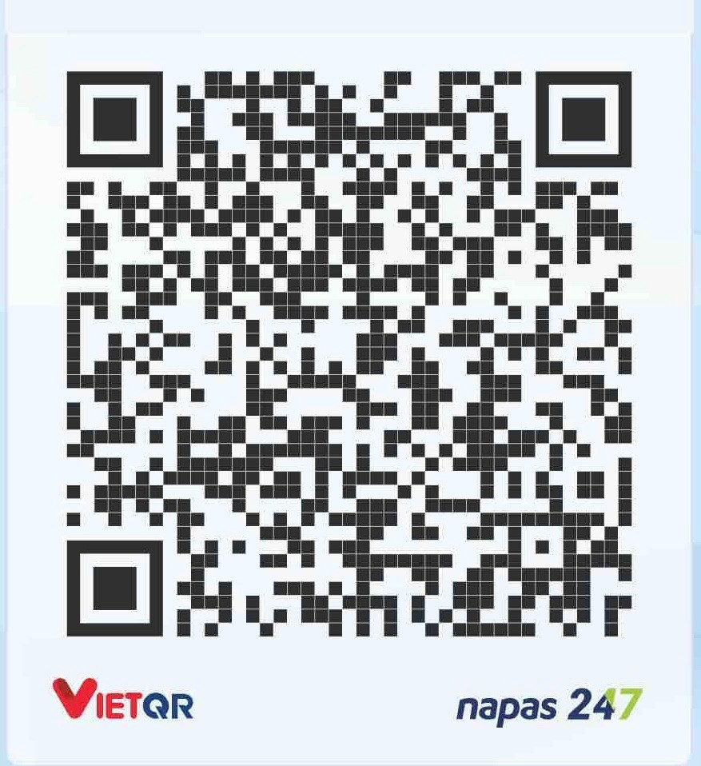

# Summary-and-Recommendation-News

## Project Overview

**Summary-and-Recommendation-News** is a web application that provides automatic summarization and recommendation of Vietnamese news articles. The project leverages a fine-tuned T5 model for Vietnamese text summarization and uses Word2Vec embeddings for recommending similar news articles. Users can input text, upload `.txt` files, or provide URLs to Vietnamese news articles, and receive concise summaries or suggestions for related articles.

## Features

- Summarize Vietnamese news articles using a T5-based model.
- Recommend similar news articles based on content similarity.
- Input options: direct text, file upload, or URL.
- User-friendly web interface built with Flask and JavaScript.

## Requirements

- Python 3.8+
- pip

## Installation

1. **Clone the repository:**
    ```sh
    git clone https://github.com/voquangtri2708/Summary-and-Recommendation-News.git
    cd Summary-and-Recommendation-News
    ```

2. **Install dependencies:**
    ```sh
    pip install -r requirements.txt
    ```

3. **Download Pretrained Models and Data:**

    Download the pretrained models and necessary files from the following Google Drive link:

    [Google Drive Project Files](https://drive.google.com/drive/folders/1uPID33z6dltk0LOO74ncMWtOAlri8szj?usp=sharing)

    - Download the entire contents of the Drive folder.
    - Place the downloaded folders and files (`models/`, `data/`, etc.) into the root directory of the project so that the structure matches:
      ```
      Summary-and-Recommendation-News/
      ├── app.py
      ├── models/
      │   ├── word.model
      │   └── SummaryNews/
      │       ├── config.json
      │       ├── generation_config.json
      │       ├── model.safetensors
      │       ├── special_tokens_map.json
      │       ├── tokenizer_config.json
      │       └── tokenizer.json
      ├── data/
      │   ├── cleaned_vnexpress.csv
      │   └── vietnamese-stopwords-dash.txt
      └── ...
      ```

4. **Run the Application:**
    ```sh
    python app.py
    ```

5. **Access the Web Interface:**

    Open your browser and go to [http://localhost:5000](http://localhost:5000)

## Usage

- **Summarize Text:** Paste Vietnamese news content or upload a `.txt` file, then select "Summarize".
- **Recommend Articles:** After inputting content, select "Suggest similar articles" to get recommendations.
- **Fetch from URL:** Click the link icon, enter a news article URL, and choose your desired action.

## Notes

- The summarization model is based on [pengold/t5-vietnamese-summarization](https://huggingface.co/pengold/t5-vietnamese-summarization).
- The dataset used is "VNDS: A Vietnamese Dataset for Summarization".
- Word2Vec is used for semantic similarity in recommendations.


---

If you encounter any issues, please check that all model and data files are correctly placed in the root directory.

---

**Buy me a coffee:**  
* MB Bank - 0347830406 * 
VO QUANG TRI

---

## Contact

For questions, feedback, or collaboration, please contact:  
**VO QUANG TRI**  
Email: voquangtri2708@gmail.com
